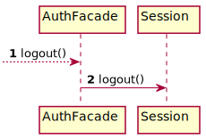

# Authentication

## Class diagram

We're using a **factory** and **DAO** pattern to abstract how we manage the persistence of our data and,
we decided to delegate the password hashing and verification to a single class to respect the
**single responsibility principle**.
Moreover, we're using the **facade** pattern to provide a simple API to the login controller.

## Staff login sequence diagram

The following sequence diagram describes how a staff logs in from the point the `loginStaff()` method of the
`LoginController` is called by the JAVAFX `LoginView`.

## Client login sequence diagram

The following sequence diagram describes how a client logs in from the point the `loginClient()` method of the
`LoginController` is called by the JAVAFX `LoginView`.

## Logout sequence diagram

The following sequence diagram describes how a client logs out from the point the `logout()` method of the
`AuthFacade` is called by any view.

