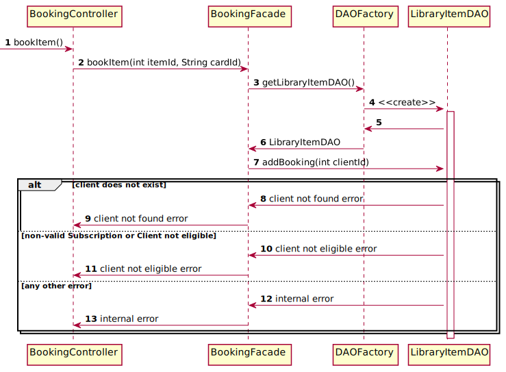

# Booking

## Class diagram
We're using a **factory** and **DAO** pattern to abstract how we manage the persistence of our data.
Moreover, we're using the **facade** pattern to provide a simple API to the booking controller.

## Sequences diagram

The following sequence diagram describes how an employee book an item for a client from the `bookItem()` methods of the
`BookkingController` called by the JAVAFX `BookingView`.

