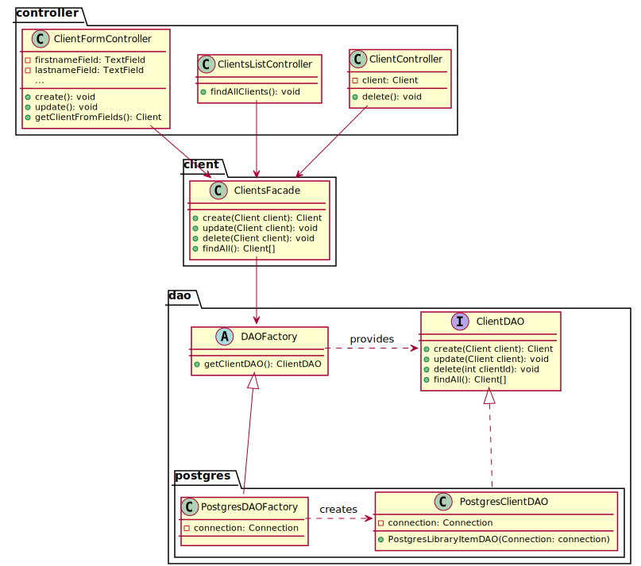
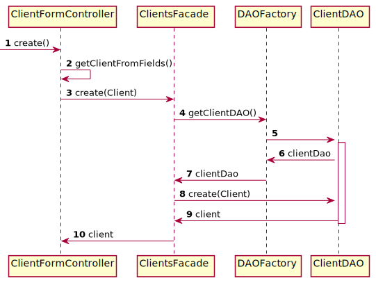
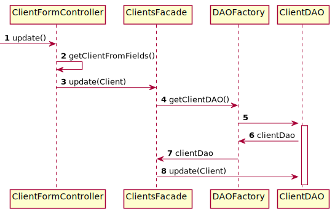
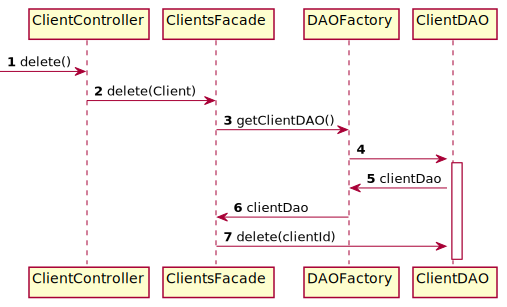
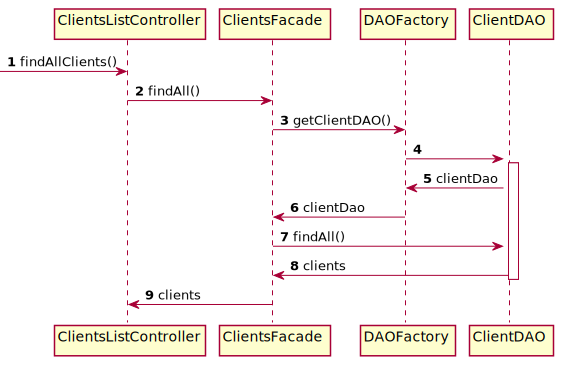

# Clients CRUD

## Class diagram

We're using a **factory** and **DAO** pattern to abstract how we manage the persistence of our data.
The creation/update logic is done in `ClientFormController#create()` and `ClientFormController#update()`
because we share the same form for creating and updating a client.
We're using also the **facade** pattern to provide a simple API to the controllers.

## Client creation sequence diagram

The following diagram describes how a client is created from the point the `create()` method of the
`ClientFormController` is called by the JavaFX view associated to it.

## Client update sequence diagram

The following diagram describes how a client is updated from the point the `update()` method of the
`ClientFormController` is called by the JavaFX view associated to it.

## Client deletion sequence diagram

The following diagram describes how a client is deleted from the point the `delete()` method of the
`ClientController` is called by the JavaFX view associated to it.

## Client listing sequence diagram

The following diagram describes how all clients are retrieved from the point the `findAllClients()` method of
the `ClientListController` is called by the JavaFX view associated to it.

