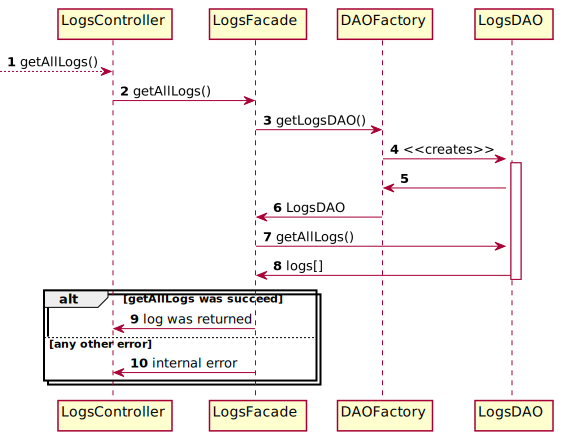

# Consult-log

## Class diagram
We're using a **factory** and **DAO** pattern to abstract how we manage the persistence of our data.
Moreover, we're using the **facade** pattern to provide a simple API to the logs controller.

## Sequences diagram

The following sequence diagram describes how a client get logs from the `getAllLogs()` methods of the
`LogsController` called by the JAVAFX `LogsView`.

