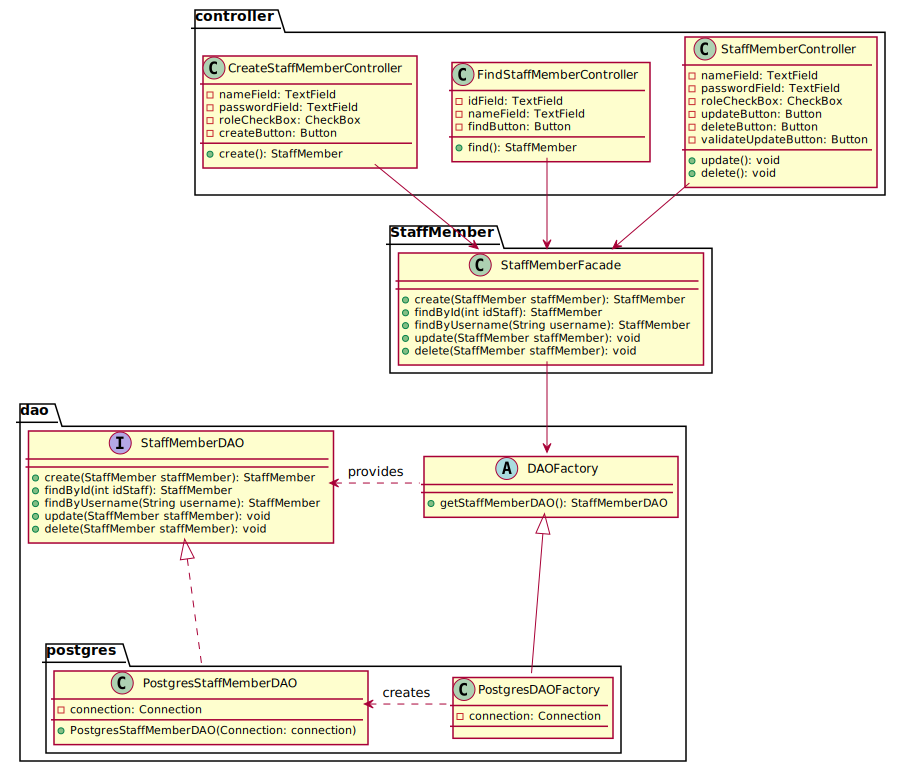
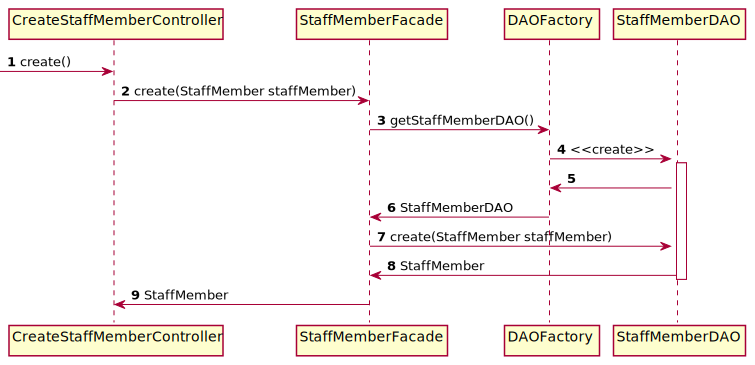
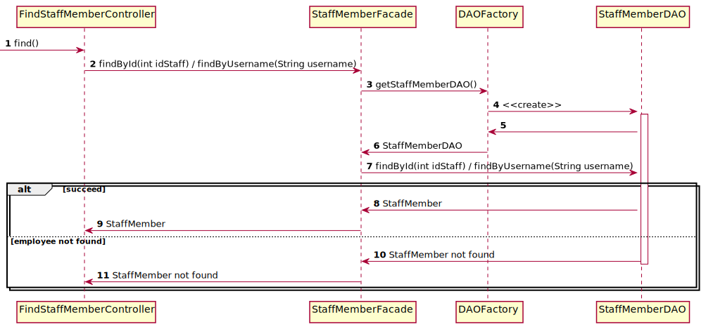
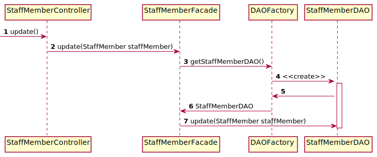
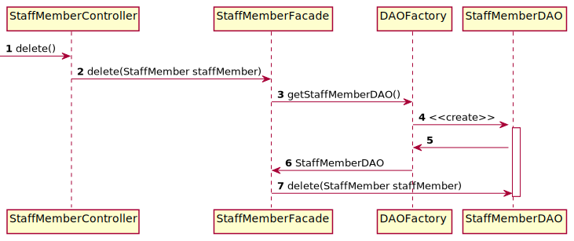

# Library items CRUD

## Class diagram

We're using a **factory** and **DAO** pattern to abstract how we manage the persistence of our data.
Moreover, we're using the **facade** pattern to provide a simple API to the booking controller.

## Staff member creation sequence diagram

The following diagram describes how a staff member is created from the point the `create()` method of the
`CreateStaffMemberController` is called by the JavaFX view associated to it.

## Staff member find sequence diagram

The following diagram describes how a staff member is found from the point the `find()` method of the
`FindStaffMemberController` is called by the JavaFX view associated to it.

## Staff member update sequence diagram

The following diagram describes how a library item is updated from the point the `update()` method of the
`StaffMemberController` is called by the JavaFX view associated to it.

## Staff member deletion sequence diagram

The following diagram describes how a library item is deleted from the point the `delete()` method of the
`StaffMemberController` is called by the JavaFX view associated to it.

