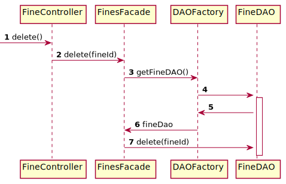

# Fines CRUD

## Class diagram

We're using a **factory** and **DAO** pattern to abstract how we manage the persistence of our data.
The creation/update logic is done in `FinesFormController#create()` and `FinesFormController#update()`
because we share the same form for creating and updating a fine.
We're using also the **facade** pattern to provide a simple API to the controllers.

## Fine creation sequence diagram

The following diagram describes how a fine is created from the point the `create()` method of the
`FinesFormController` is called by the JavaFX view associated to it.

## Fine update sequence diagram

The following diagram describes how a fine is updated from the point the `update()` method of the
`FinesFormController` is called by the JavaFX view associated to it.

## Fine deletion sequence diagram

The following diagram describes how a fine is deleted from the point the `delete()` method of the
`FineController` is called by the JavaFX view associated to it.

    