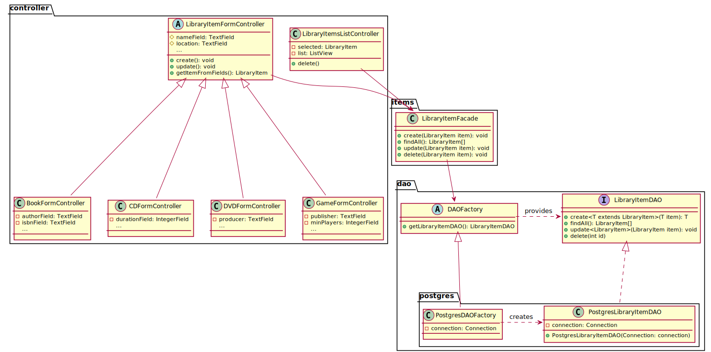
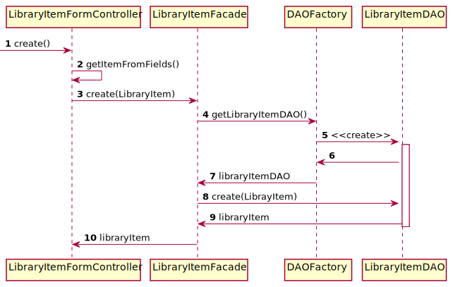
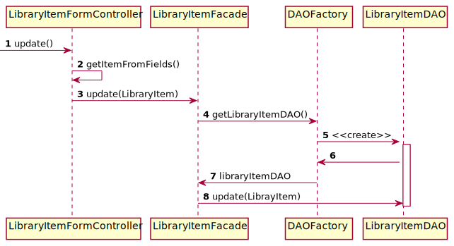
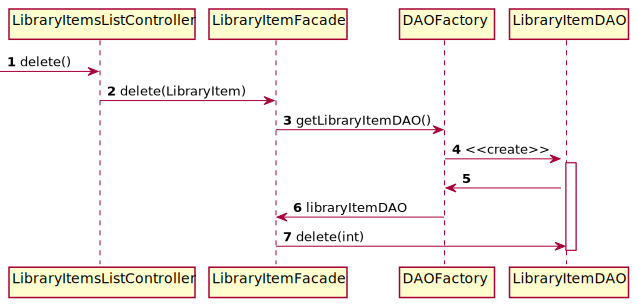

# Library items CRUD

## Class diagram

We're using a **factory** and **DAO** pattern to abstract how we manage the persistence of our data.
Because we have many types of LibraryItem and that each of them has different attributes, we can't use the same
controller for each of them when creating/updating it. The creation/update logic is done in
`LibraryItemFormController#create()` and `LibraryItemFormController#update()`, each of calls 
`LibraryItemFormController#getItem()` that is implemented by the controllers specific to each type of library item
we support.
Moreover, we're using the **facade** pattern to provide a simple API to the controllers.

## Library item creation sequence diagram

The following diagram describes how a library item is created from the point the `create()` method of the
`LibraryItemFormController` is called by the JavaFX view associated to it.

## Library item update sequence diagram

The following diagram describes how a library item is updated from the point the `update()` method of the
`LibraryItemFromController` is called by the JavaFX view associated to it.

## Library item deletion sequence diagram

The following diagram describes how a library item is deleted from the point the `delete()` method of the
`LibraryItemsListController` is called by the JavaFX view associated to it.

    