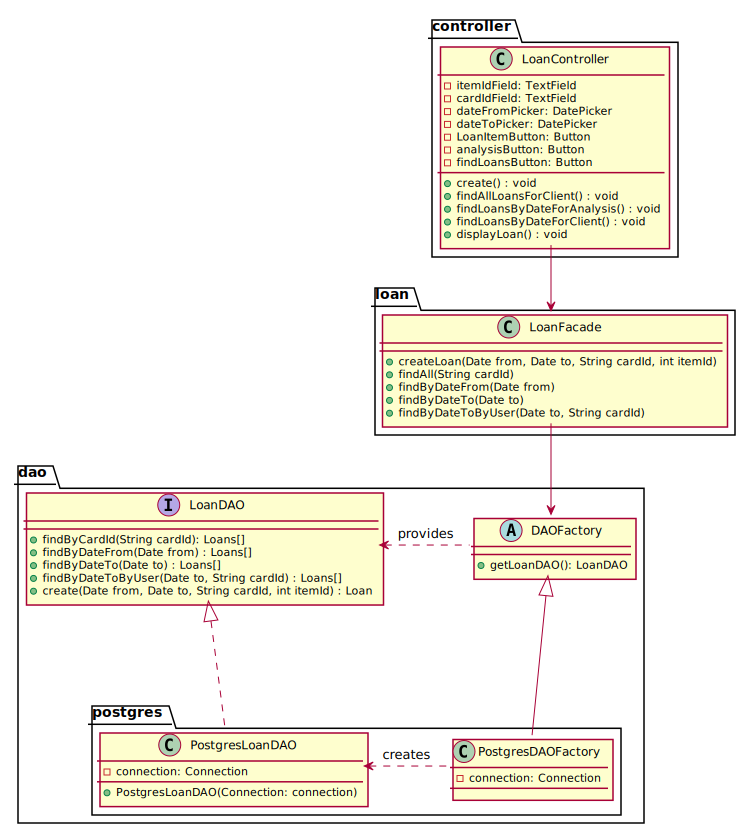

# Loan

## Class diagram
We're using a **factory** and **DAO** pattern to abstract how we manage the persistence of our data.
Moreover, we're using the **facade** pattern to provide a simple API to the loan controller.

## Sequences diagram

The following sequence diagram describes how a client create loan from the `create()` & `findAllLoansForClient()` & `findLoansByDateForAnalysis()` & `findLoansByDateForClient()`  methods of the
`LoanController` called by the JAVAFX `LoanView`.

