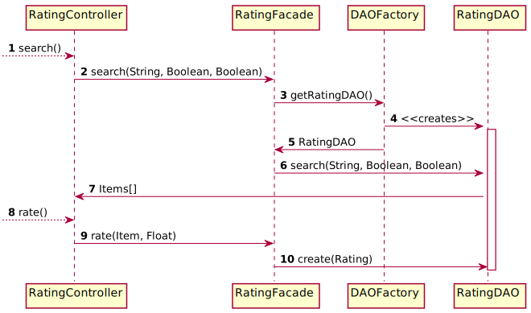

# Item rating

## Class diagram

We're using a **factory** and **DAO** pattern to abstract how we manage the persistence of our data.
Moreover, we're using the **facade** pattern to provide a simple API to the rating controller.

## Subscription sequence diagram

The following sequence diagram describes how a client consult and rate borrowed items from the `search()` & `rate()`methods of the
`RatingController` called by the JAVAFX `RatingView`.

