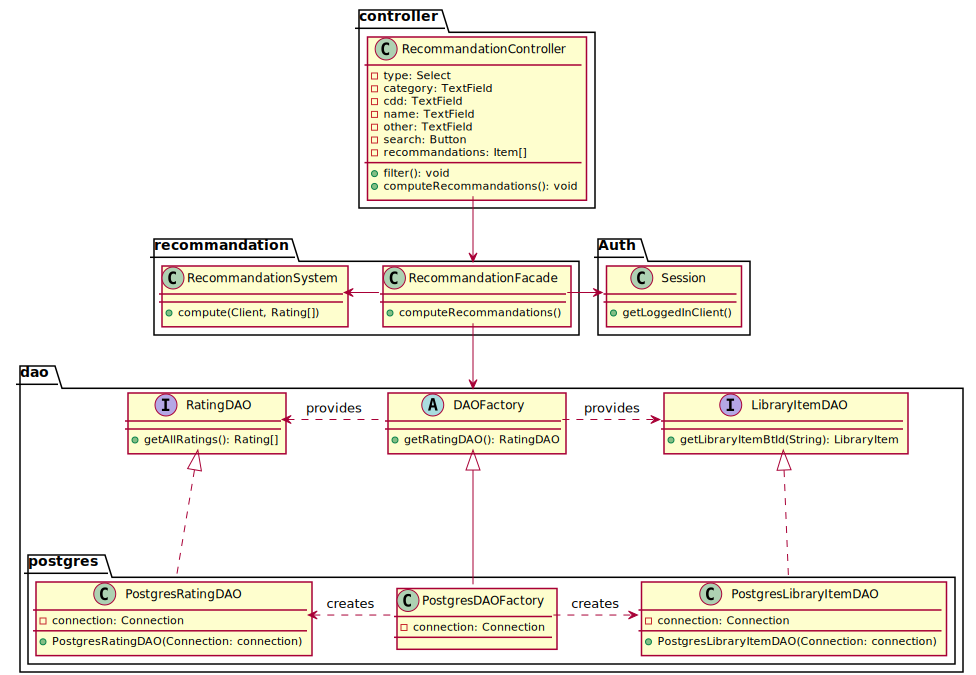
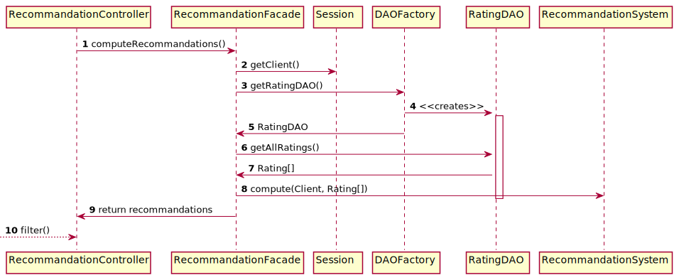

# Recommandations

## Class diagram

We're using a **factory** and **DAO** pattern to abstract how we manage the persistence of our data.
Moreover, we're using the **facade** pattern to provide a simple API to the recommandation controller.

## Subscription sequence diagram

The following sequence diagram describes how a client consult his(her) recommandations from the `computeRecommandations()` method of the
`RecommandationController` called by the JAVAFX `RecommandationView`.

 
