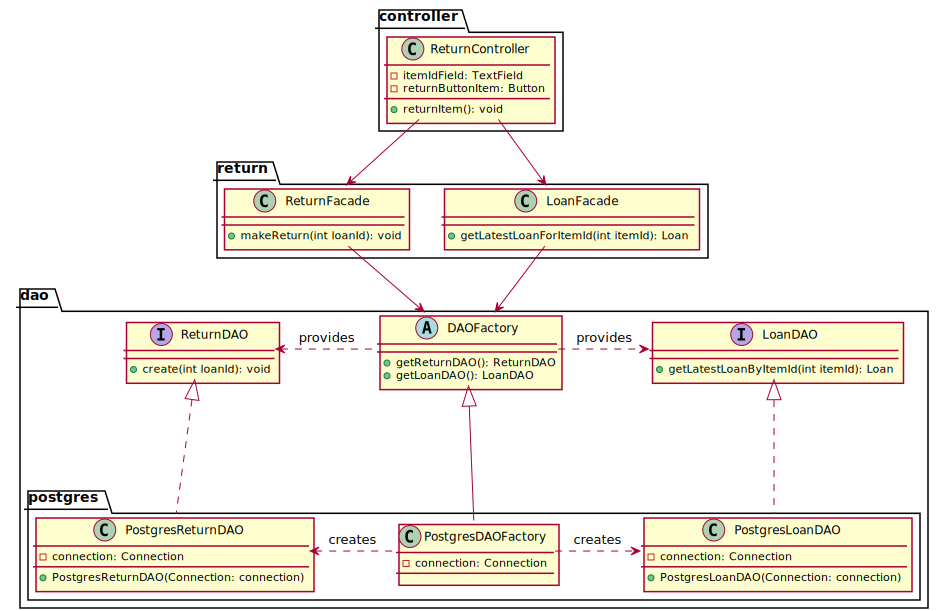

# Booking

## Class diagram
We're using a **factory** and **DAO** pattern to abstract how we manage the persistence of our data.
Moreover, we're using the **facade** pattern to provide a simple API to the return controller.

## Sequences diagram

The following sequence diagram describes how an employee return an item for a client from the `returnItem()` methods of the
`ReturnController` called by the JAVAFX `ReturnView`.

