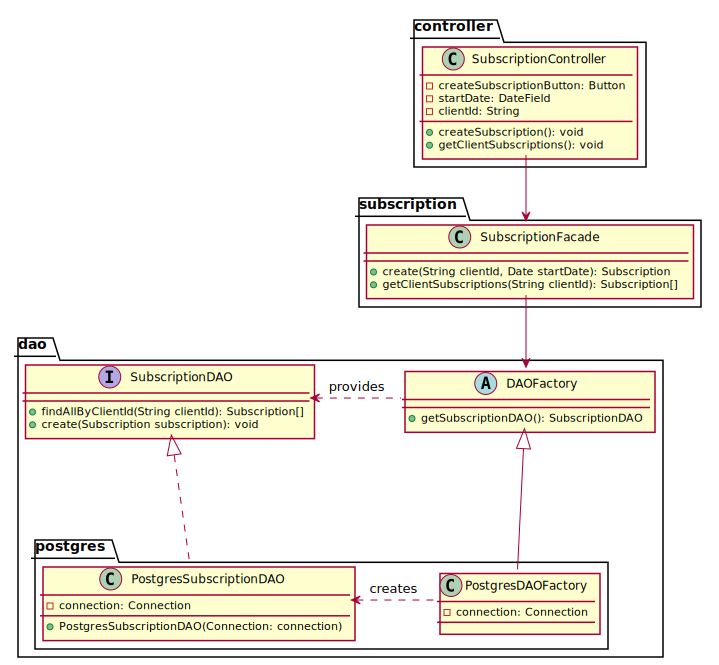
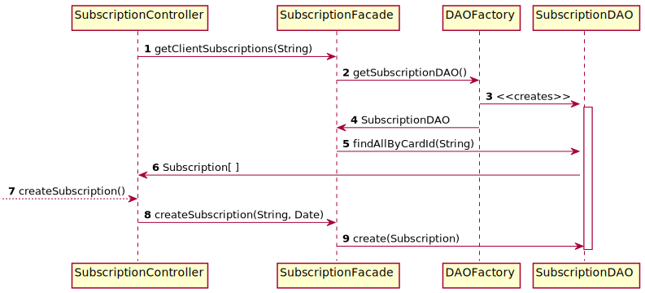

# Subscription

## Class diagram

We're using a **factory** and **DAO** pattern to abstract how we manage the persistence of our data.
Moreover, we're using the **facade** pattern to provide a simple API to the subscription controller.

## Subscription sequence diagram

The following sequence diagram describes how a staff consult and create new subscription(s) from the `getClientSubscriptions()` & `createSubscription()`methods of the
`SubscriptionController` called by the JAVAFX `SubscriptionView`.

