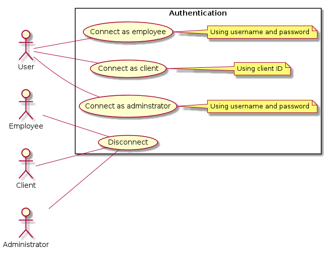

# 1. Authenticate to media library system

## Use Case Diagram

## 1.1 Brief Description

This use case allows any user to handle its authentication to the system. This includes logging in (as an employee, an adminstrator or a client) and logging out.

## 1.2 Flow of events

### 1.2.1 Basic Flow

This use case starts when an user of the media library system wants to authenticate (log in) or disconnect (log out).

* If the user wants to authenticate as an employee or an administrator, the user clicks on "Employee" tab of login page and fills username and password input boxes with its credentials then clicks on button "Authenticate me". The user is authenticated and redirected to it's action center.
* If the user wants to authenticate as a client, the user clicks on "Client" tab of login page and fill the input box with its client ID then clicks on the "Authenticate me" button. The user is authenticated and redirected to it's action center.
* If the user wants to disconnect (whatever he’s authenticated as), the user clicks on the “Logout” button, then the system logs the user out.

### 1.2.2 Alternative Flows

#### 1.2.2.1 Invalid Username/Password

If the employee or administrator enters an invalid username and/or password, the system displays an error message. The actor can either return to the beginning of "Basic Flow" or cancel the login, at which point the use case ends.

#### 1.2.2.2 Invalid client ID

If the client enters an invalid client ID, the system displays an error message. The actor can either return to the beginning of the “Basic Flow” or cancel the login, at which point the use case ends.

## 1.3 Special Requirements

None.

## 1.4 Pre-Conditions

If the user wants to authenticate, he/she must not be authenticated before.

If the user wants to logout, the user must be logged into the system before.

## 1.5 Post-Conditions

If the use case was successful, the authentication state of the user changed (logged as an employee, a client or an administrator, or disconnected). If not, the system state is unchanged.

## 1.6 Extension Points

None.