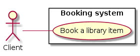
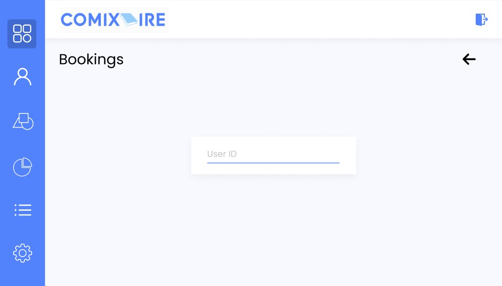
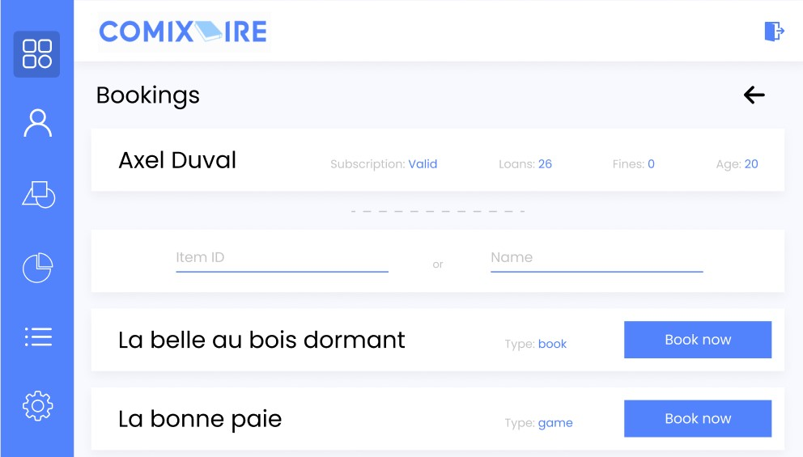

# 1. Bookings

## Use Case Diagram

## 1.1 Brief Description

This use case allows employees to book item for client.

## 1.2 Flow of Events

### 1.2.1 Basic Flow

This use case starts when a client wants to book an item at the front desk.

* The system asks for a client ID
* The employee scan client’s card and a client preview is shown
* The employee search for a specific item and selects it
* System add the client to the booking queue of selected item
* The system saves the booking and display a success notification telling the booking was saved

### 1.2.2 Alternative Flows

#### 1.2.2.1 Client Not Found

* System cannot retrieve client, then display an error notification telling client not found
* System abort booking action

#### 1.2.2.2 Client Not Eligible

* The employee cannot select the booking action on client’s actions center because the client is not eligible (fines and dues not paid)

## 1.3 Pre-Conditions

The employee must be logged onto the system before this use case begins

## 1.4 Post-Conditions

If the use case was successful, the booking is saved. The item is now booked. Otherwise, the item state is unchanged

