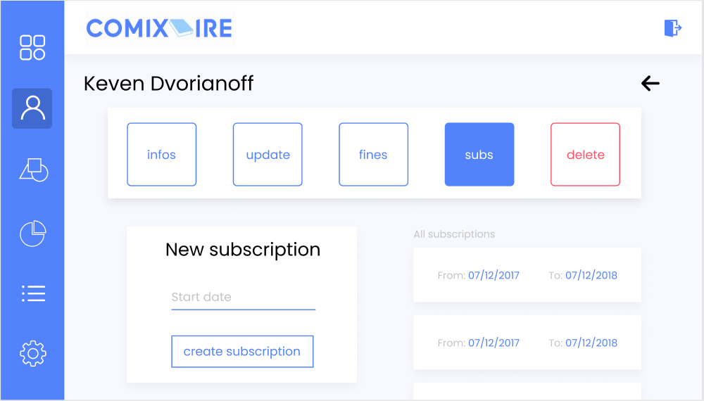

# Manage client and client's subscription

## Use Case Diagram

## Brief Description

This use case allows an employee to manage client’s subscriptions. 

## Flow of events

### Basic Flow

This use case starts when an employee wishes to create, read client subscription from the system.

The system requests that an administrator or an employee specify the function he/she would like to perform (either Create a Subscription, Read a Subscription)

Once an administrator or an employee provides the requested information, one of the sub flows is executed.

* If an administrator or an employee selected “Create a Subscription“, the Create a Subscriptions ub-flow is executed.
* If an administrator or an employee selected “Read a Subscription“, the Read a Subscription sub-flow is executed.

#### Create a Subscription

The system requests that an administrator or an employee enters the subscription information. This includes:
* StartDate
* …

Once an administrator or an employee provides the requested information, the system generates and assigns a unique subscription id number to the subscription. The subscription is added to the system.

The system provides an administrator or an employee with the new subscription id.

			
#### Read a subscription

* The system requests that an administrator or an employee enters the subscription id. 
* An administrator or an employee enters the subscription id.  
* The system retrieves and displays the subscription information.

### 2.1. Alternative Flows

#### Subscription not found

If in the Read a Subscription, a subscription with the specified id number does not exist, the system displays an error message. An administrator or an employee can then enter a different id number or cancel the operation, at which point the use case ends.

## Special requirements

None.

## Pre-Conditions

Employee must be logged in the system.

## Post-Condition

If the use case was successful, the subscription information is created or read from the system.  Otherwise, the system state is unchanged.

## Extension Points

None.

## Mock-ups

