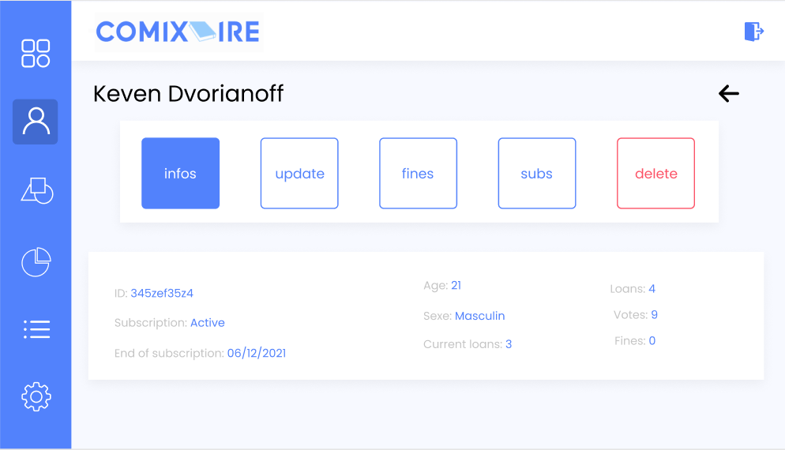

# Manage client and client's subscription

## Use Case Diagram

## Brief Description

This use case allows an employee to manage clients. 

## Flow of events

### Basic Flow

This use case starts when an employee wishes to create, read, update and/or delete client from the system.

The system requests that an administrator  or an employee specify the function he/she would like to perform (either Create a Client, Read a Client, Update a Client, or Delete a Client)

Once an administrator or an employee provides the requested information, one of the sub flows is executed.

* If an administrator or an employee selected “Create a Client“, the Create a Client ub-flow is executed.
* If an administrator or an employee selected “Read a Client“, the Read a Client sub-flow is executed.
* If an administrator or an employee selected “Update a Client“, the Update a Client sub-flow is executed.
* If an administrator or an employee selected “Delete a Client“, the Delete a Client sub-flow is executed

#### Create a Client

The system requests that an administrator or an employee enters the Client information. This includes:
* Fristame
* LastName
* Sexe
* Birth date
* Address
* …

Once an administrator or an employee provides the requested information, the system generates and assigns a unique Client id number to the Client. The Client is added to the system.

The system provides an administrator or an employee with the new Client id.

			
#### Read a Client

* The system requests that an administrator or an employee enters the Client id. 
* An administrator or an employee enters the Client id.  
* The system retrieves and displays the Client information.

#### Update a Client 

* The system requests that an administrator or an employee enters the Client id.
* An administrator or an employee enters the Client id.  The system retrieves and displays the Client information.
* An administrator or an employee makes the desired changes to the Client information. This includes any of the information specified in the Create a Client sub-flow.
* Once an administrator or an employee updates the necessary information, the system updates the Client record with the updated information.

#### Delete a Client

* The system requests that an administrator or an employee enters the Client id. 	
* An administrator or an employee enters the document id.  The system retrieves and displays the Client information.
* The system prompts an administrator or an employee to confirm the deletion of the Client.
* An administrator or an employee verifies the deletion.
* The system removes the Client from the system.

### 2.1. Alternative Flows

#### Client not found

If in the Read a Client, Update a Client or Delete a Client sub-flows, a Client with the specified id number does not exist, the system displays an error message. An administrator or an employee can then enter a different id number or cancel the operation, at which point the use case ends.

#### Deleted cancelled

If in the Delete a Client sub-flow, an administrator or an employee decides not to delete the Client, the delete is cancelled, and the Basic Flow is re-started at the beginning.

## Special requirements

None.

## Pre-Conditions

Employee must be logged in the system.

## Post-Condition

If the use case was successful, the Client information is created, updated, read, or deleted from the system.  Otherwise, the system state is unchanged.

## Extension Points

None.

## Mock-ups

