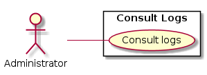
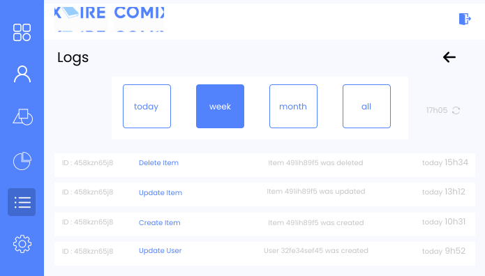

# 1. Consult Logs

## Use Case Diagram

## 1.1 Brief Description

This use case allows an administrator to consult previous operations made by employees and administrators.

## 1.2 Flow of Events

### 1.2.1 Basic Flow

This use case starts when an administrator wants to see previous operations made by employees and administrators.

* The system requests that an administrator go on the logs page.
* Once an administrator goes on the logs page, the system retrieves the logs information.
* The system displays the logs information. This includes:
    * Employee id
    * Date
    * Operation type
    * Operations details
	

### 1.2.2 Alternative Flows

None.

## 1.3 Special Requirements

None.

## 1.4 Pre-Conditions

An administrator must be logged onto the system before this use case begins.

## 1.5 Post-Conditions

The system state is unchanged.

## 1.6 Extension Points

None. 

