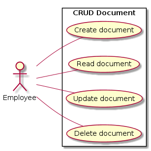

# Use Case Diagram

# 1. Maintain Document Information

## 1.1 Brief Description

This use case allows an administrator or an employee to maintain document information. This includes creating, reading, updating, and deleting document information from the system.

## 1.2 Flow of Events

### 1.2.1 Basic Flow

This use case starts when an administrator or an employee wishes to create, read, update and/or delete document information from the system.

* The system requests that an administrator or an employee specify the function he/she would like to perform (either Create a Document, Read a Document, Update a Document, or Delete a Document)
* Once an administrator or an employee provides the requested information, one of the sub flows is executed.

If an administrator or an employee selected “Create a Document“, the "[Create a Document](#1211-create-a-document)" sub-flow is executed.

If an administrator or an employee selected “Read a Document“, the "[Read a Document](#1212-read-a-document)" sub-flow is executed.

If an administrator or an employee selected “Update a Document“, the "[Update a Document](#1213-update-a-document)" sub-flow is executed.

If an administrator or an employee selected “Delete a Document“, the "[Delete a Document](#1214-delete-a-document)" sub-flow is executed.

#### 1.2.1.1 Create a Document

The system requests that an administrator or an employee enters the document information. This includes:
* Name
* Document type (book / game / CD / DVD)
* Category
* Editor(s) / Author(s) / Director(s) / Artist(s)
* CDD (for book only)
* Status (available / unavailable / reserved)
* Condition
* Location

Once an administrator or an employee provides the requested information, the system generates and assigns a unique document id number to the document. 

The document is added to the system.

The system provides an administrator or an employee with the new document id.

#### 1.2.1.2 Read a Document

* The system requests that an administrator or an employee enters the document id. 
* An administrator or an employee enters the document id. The system retrieves and displays the document information.

#### 1.2.1.3 Update a Document

* The system requests that an administrator or an employee enters the document id.
* An administrator or an employee enters the document id. The system retrieves and displays the document information.
* An administrator or an employee makes the desired changes to the document information. This includes any of the information specified in the "[Create a Document](#1211-create-a-document)" sub-flow.
* Once an administrator or an employee updates the necessary information, the system updates the document record with the updated information.

#### 1.2.1.4 Delete a Document

* The system requests that an administrator or an employee enters the document id. 
* An administrator or an employee enters the document id. The system retrieves and displays the document information.
* The system prompts an administrator or an employee to confirm the deletion of the document.
* An administrator or an employee verifies the deletion.
* The system removes the document from the system.

### 1.2.2 Alternative Flows

#### 1.2.2.1 Document Not Found

If in the "[Read a Document](#1212-read-a-document)", "[Update a Document](#1213-update-a-document)" or "[Delete a Document](#1214-delete-a-document)" sub-flows, a document with the specified id number does not exist, the system displays an error message. An administrator or an employee can then enter a different id number or cancel the operation, at which point the use case ends.

#### 1.2.2.2 Delete Cancelled

If in the "[Delete a Document](#1214-delete-a-document)" sub-flow, an administrator or an employee decides not to delete the document, the delete is cancelled, and the "[Basic Flow](#121-basic-flow)" is re-started at the beginning.

## 1.3 Special Requirements

None.

## 1.4 Pre-Conditions

An administrator or an employee must be logged onto the system before this use case begins.

## 1.5 Post-Conditions

If the use case was successful, the document information is created, updated, read, or deleted from the system. Otherwise, the system state is unchanged.

## 1.6 Extension Points

None. 
