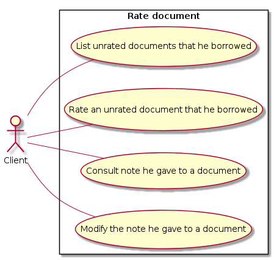

# Use Case Diagram

# 1. Rate borrowed document

## 1.1 Brief Description

This use case allows a client to rate documents he/she borrowed. This use case also allows the client to consult documents he/she borrowed and to modify the note he/she gave to a document.

## 1.2 Flow of events

### 1.2.1 Basic Flow

This use case starts when an authenticated client wants to rate a document he borrowed.

To do so, he/she just has to ask the system to display documents he borrowed.

* If the client wants to list documents he/she didn’t rate, then the “[Filter documents](#1211-filter-documents)” subflow is executed.
* If the client wants to rate a document he/she didn’t rate, then the “[Rate unrated document](#1212-rate-unrated-document)” subflow is executed.
* If the client wants to consult the note he/she gave to a document, then the “[Consult document note](#1213-consult-document-note)” subflow is executed.
* If the client wants to modify the note he/she gave to a document, then the “[Modify document note](#1214-modify-document-note)” subflow is executed.

#### 1.2.1.1 Filter documents

The client provides the system filter rules by clicking on some inputs :

* Rated/Unrated
* Note between X and Y
* Search bar taking a string

Then the system displays all documents matching the filter.

#### 1.2.1.2 Rate unrated document

* The client searches the document in the displayed list then clicks on the “Rate” button.
* The system asks the user to provide an integer between 1 and 5 (both inclusive).
* The system sets the given value as the note given by this client  for this document.

#### 1.2.1.3 Consult document note

The client searches the document in the displayed list. The note he/she gave is displayed on the document overview.

#### 1.2.1.4 Modify document note

The client searches the document in the displayed list. He/she can modify the note by clicking on the currently displayed.
The system then updates the note given by this client for this document.

### 1.2.2 Alternative Flows

None.

## 1.3 Special Requirements

None.

## 1.4 Pre-Conditions

The client is logged in the system.

## 1.5 Post-conditions

If the subflows “[Rate unrated document](#1212-rate-unrated-document)” or “[Modify document note](#1214-modify-document-note)” are executed, the system state changed and a document note given by an user is updated.

If the subflows “[Filter documents](#1211-filter-documents)” or “[Consult document note](#1213-consult-document-note)” are executed, the system state is unchanged.

## 1.6 Extension Points

None.

