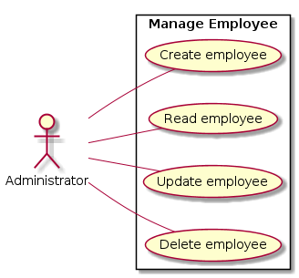
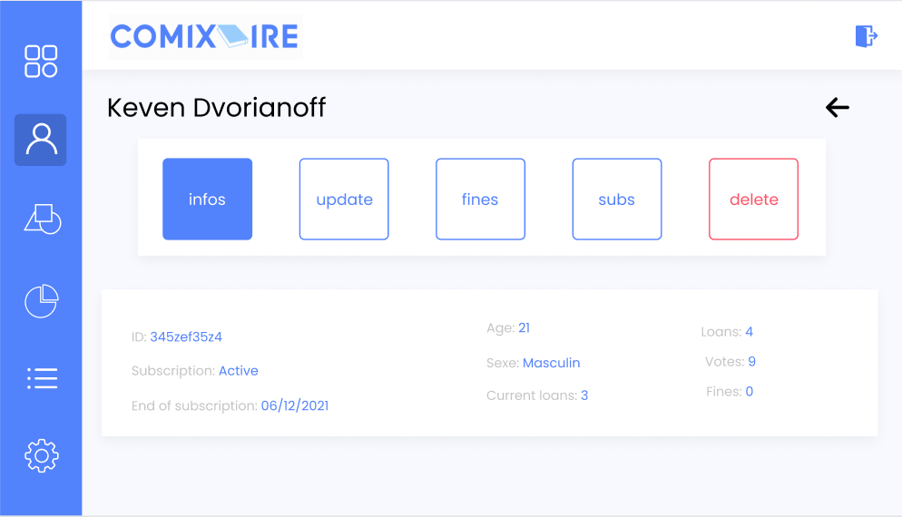
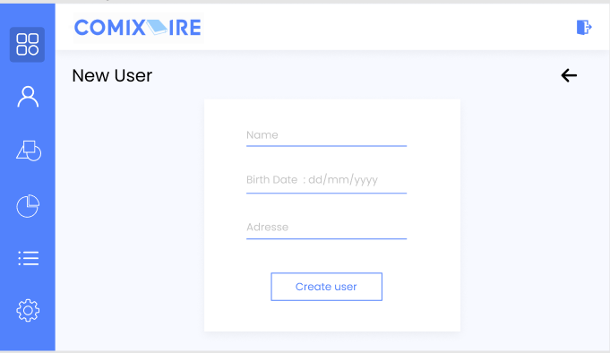
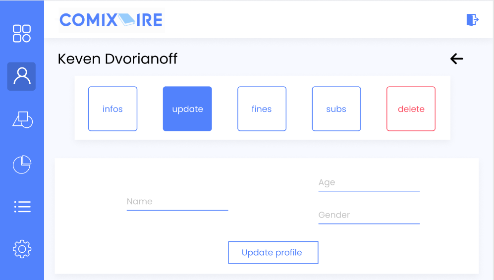

# Employee management

## Use Case Diagram

## Brief Description

This use case allows an employee to manage employee.

## Flow of events

### Basic Flow

This use case starts when an employee wishes to create, read, update and/or delete employee from the system.

The system requests that an administrator specify the function he/she would like to perform (either Create an employee, Read an employee, Update an employee, or Delete an employee)

Once an administrator provides the requested information, one of the sub flows is executed.

* If an administrator selected “Create an employee“, the Create an employee sub-flow is executed.
* If an administrator selected “Read an employee“, the Read an employee sub-flow is executed.
* If an administrator selected “Update an employee“, the Update an employee sub-flow is executed.
* If an administrator selected “Delete an employee“, the Delete an employee sub-flow is executed

#### Create an employee

The system requests that an administrator enters the employee information. This includes:
* FirstName
* Lastname
* Phone
* Address
* Birth date
* Date of hire 
* ...

Once an administrator provides the requested information, the system generates and assigns a unique employee id number to the employee. The employee are added to the system.

The system provides an administrator with the new employee id.
			
#### Read an employee

* The system requests that an administrator enters the employee id. 
* An administrator enters the employee id.  The system retrieves and displays the employee information.

#### Update an employee 

* The system requests that an administrator enters the employee id.
* An administrator enters the employee id.  The system retrieves and displays the employee information.
* An administrator makes the desired changes to the employee information. This includes any of the information specified in the Create an employee sub-flow.
* Once an administrator updates the necessary information, the system updates the employee record with the updated information.

#### Deleted an employee

* The system requests that an administrator enters the employee id. 	
* An administrator enters the document id.  The system retrieves and displays the employee information.
* The system prompts an administrator to confirm the deletion of the employee.
* An administrator verifies the deletion.
* The system removes the employee from the system.

### Alternative Flows

#### employee not found

If in the Read an employee, Update an employee or Delete an employee sub-flows, an employee with the specified id number does not exist, the system displays an error message. An administrator can then enter a different id number or cancel the operation, at which point the use case ends.

#### Deleted cancelled

If in the Delete an employee sub-flow, an administrator decides not to delete the employee, the delete is cancelled, and the Basic Flow is re-started at the beginning.

## Special requirements

None.

## Pre-Conditions

Administrator must be logged in the system.

## Post-Condition

If the use case was successful, the employee information is created, updated, read, or deleted from the system.  Otherwise, the system state is unchanged.

## Extension Points

None.

## Mockup

