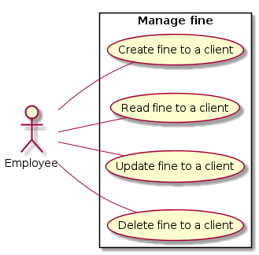

# 1. Fine Management

## Use Case Diagram

## 1.1 Brief Description

This use case allows an employee to manage client’s fines. 

## 1.2 Flow of events

### 1.2.1 Basic Flow

This use case starts when an employee wants to create, update, view or delete a client fine.
The admin does one action and this action is validated in the database.

* Admin go to the manage fine menu
* Then click on (create, update, view or delete) fine 
* If create : have a form to enter the information about the fine 
* If update : the system ask the Id of fine and client and the admin can change information about a fine 
* If view : the system ask the id of the fine and client and admin can view the informations about the fine he can go to the page update by this page 
* If delete the system ask the id of the fine and ask a confirmation to delete

### 1.2.2 Alternative Flows

#### 1.2.2.1 Invalid client ID for update

The admin wants to update a non existing fine, the system displays an error message and proposes to create this fine.

#### 1.2.2.2 Invalid client ID for view or delete

The admin wants to view or delete a non existing fine, the system displays an error message.

#### 1.2.2.3 Special requirements

None.

## 1.3 Pre-Conditions

Employee must be logged in the system.

## 1.4 Post-Condition

None.

## 1.5 Extension Points

None.
