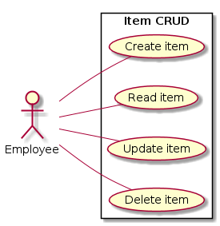

# 1. Maintain Item Information

## Use Case Diagram

## 1.1 Brief Description

This use case allows an administrator or an employee to maintain item information. This includes creating, reading, updating, and deleting item information from the system.

## 1.2 Flow of Events

### 1.2.1 Basic Flow

This use case starts when an administrator or an employee wishes to create, read, update and/or delete item information from the system.

* The system requests that an administrator or an employee specify the function he/she would like to perform (either Create a Item, Read a Item, Update a Item, or Delete a Item)
* Once an administrator or an employee provides the requested information, one of the sub flows is executed.

If an administrator or an employee selected “Create a Item“, the **Create a Item** sub-flow is executed.

If an administrator or an employee selected “Read a Item“, the **Read a Item** sub-flow is executed.

If an administrator or an employee selected “Update a Item“, the **Update a Item** sub-flow is executed.

If an administrator or an employee selected “Delete a Item“, the **Delete a Item** sub-flow is executed.

#### 1.2.1.1 Create a Item

The system requests that an administrator or an employee enters the item information. This includes:
* Name
* Item type (book / game / CD / DVD)
* Category
* Editor(s) / Author(s) / Director(s) / Artist(s)
* CDD (for book only)
* Status (available / unavailable / reserved)
* Condition
* Location

Once an administrator or an employee provides the requested information, the system generates and assigns a unique item id number to the item. 

The item is added to the system.

The system displays a succes notification saying that the item has been successfully created.

#### 1.2.1.2 Read a Item

* The system requests that an administrator or an employee enters the item id. 
* An administrator or an employee enters the item id. The system retrieves and displays the item information.

#### 1.2.1.3 Update a Item

* The system requests that an administrator or an employee enters the item id.
* An administrator or an employee enters the item id. The system retrieves and displays the item information.
* An administrator or an employee makes the desired changes to the item information. This includes any of the information specified in the **Create a Item** sub-flow.
* Once an administrator or an employee updates the necessary information, the system updates the item record with the updated information and displays a succes notification saying that the item has been successfully updated.

#### 1.2.1.4 Delete a Item

* The system requests that an administrator or an employee enters the item id. 
* An administrator or an employee enters the item id. The system retrieves and displays the item information.
* The system prompts an administrator or an employee to confirm the deletion of the item.
* An administrator or an employee verifies the deletion.
* The system removes the item from the system and diplays a succes notification saying that the item has been successfully deleted.

### 1.2.2 Alternative Flows

#### 1.2.2.1 Item Not Found

If in the **Read a Item**, **Update a Item** or **Delete a Item** sub-flows, an item with the specified id number does not exist, the system displays an error notification saying that the item was not found. An administrator or an employee can then enter a different id number or cancel the operation, at which point the use case ends.

#### 1.2.2.2 Delete Cancelled

If in the **Delete a Item** sub-flow, an administrator or an employee decides not to delete the item, the delete is cancelled, and the **Basic Flow** is re-started at the beginning.

## 1.3 Special Requirements

None.

## 1.4 Pre-Conditions

An administrator or an employee must be logged onto the system before this use case begins.

## 1.5 Post-Conditions

If the use case was successful, the item information is created, updated, read, or deleted from the system. Otherwise, the system state is unchanged.

## 1.6 Extension Points

None. 
