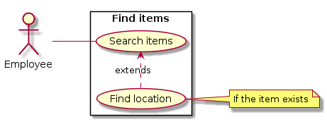

# Use Case Diagram

# 1. Find Items

## 1.1 Brief Description

This use case allows an administrator, an employee, or a client to find the location of an item.

## 1.2 Flow of Events

### 1.2.1 Basic Flow

This use case starts when an administrator, an employee, or a client wants to find the location of an item in the library.

* The system requests that an administrator, an employee, or a client specifies one or more information about an item.
* Once an administrator, an employee, or a client provides at least one information (Name, Item type, Category, Editor(s) / Author(s) / Director(s) / Artist(s), and/or CDD), the system retrieves and displays a list of items.
* An administrator, an employee, or a client can then select an item to get more information about the desired item.
* The system provides an administrator, an employee, or a client with all the information available on an item including its location in the library.

### 1.2.2 Alternative Flows

#### 1.2.2.1 No Result

If no item matches the search, the system displays a "no result" message. An administrator, an employee, or a client can then enter different information or cancel the operation, at which point the use case ends.

#### 1.2.2.2 Search Cancelled

If in the **Basic Flow**, an administrator, an employee, or a client decides to cancel the operation, the use case ends.

#### 1.2.2.3 New Search

If in the **Basic Flow**, an administrator, an employee, or a client decides to search for a new item, the **Basic Flow** is re-started at the beginning.

## 1.3 Special Requirements

None.

## 1.4 Pre-Conditions

An administrator, an employee, or a client must be logged onto the system before this use case begins.

## 1.5 Post-Conditions

The system state is unchanged.

## 1.6 Extension Points

None. 
