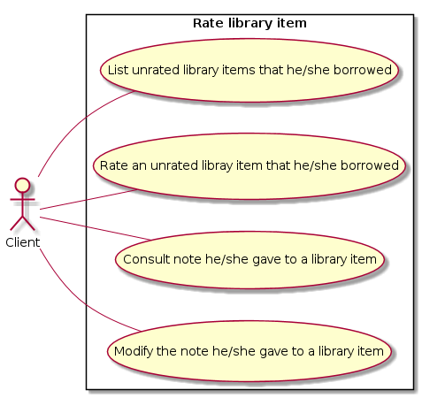

# 1. Rate borrowed library item

## Use Case Diagram

## 1.1 Brief Description

This use case allows a client to rate library items he/she borrowed. This use case also allows the client to consult library items he/she borrowed and to modify the note he/she gave to a library item.

## 1.2 Flow of events

### 1.2.1 Basic Flow

This use case starts when an authenticated client wants to rate a library item he/she borrowed.

To do so, he/she just has to ask the system to display library items he/she borrowed.

* If the client wants to list library items he/she didn’t rate, then the “Filter borrowed library items” subflow is executed.
* If the client wants to rate a library item he/she didn’t rate, then the “Rate unrated library item” subflow is executed.
* If the client wants to consult the note he/she gave to a library item, then the “Consult library item note” subflow is executed.
* If the client wants to modify the note he/she gave to a library item, then the “Modify library item note” subflow is executed.

#### 1.2.1.1 Filter library items

The client provides the system filter rules by clicking on some inputs :

* Rated/Unrated
* Note between X and Y
* Search bar taking a string

Then the system displays all library items matching the filter.

#### 1.2.1.2 Rate unrated library item

* The client searches the library item in the displayed list then clicks on the “Rate” button.
* The system asks the user to provide an integer between 1 and 5 (both inclusive) by selecting stars.
* The system sets the given value as the note given by this client for this library item.

#### 1.2.1.3 Consult library item note

The client searches the library item in the displayed list. The note he/she gave is displayed on the library item overview.

#### 1.2.1.4 Modify library item note

The client searches the library item in the displayed list. He/she can modify the note by clicking on the currently displayed stars.
The system then updates the note given by this client for this library item.

### 1.2.2 Alternative Flows

None.

## 1.3 Special Requirements

None.

## 1.4 Pre-Conditions

The client is logged in the system.

## 1.5 Post-conditions

If the client rated a library item or modified a note he/she gave to a library item, the system state changed and a library item note given by an user is updated.

In the other cases, the systme state is unchanged.

## 1.6 Extension Points

None.

