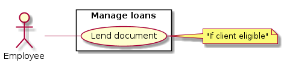

# Use Case Diagram

# 1. Manage Loans

## 1.1 Brief Description

This use case allows employees to create loans for clients.

## 1.2 Flow of Events

### 1.2.1 Basic Flow

This use case starts when a client come to borrow an item at the front desk.

* The employee scan client’s card or enter client ID
* The system retrieves and displays the client information
* The employee scan item(s)
* The employee click on a button to perform the transaction
* The system saves the loan information and displays a success notification

### 1.2.2 Alternative Flows

#### 1.2.2.1 Client Not Found

* System cannot retrieve client’s information, then display an error notification
* System abort loan action.

#### 1.2.2.2 Non-Valid Subscription or Client Not Eligible

* Employee cannot select the loan action because of the client do not have a valid subscription or is not eligible (several fines and dues)

#### 1.2.2.3 Item Not Found

* The employee scan an item
* System cannot retrieve item information, then dispay an error notification telling the item is not found
* System continue his execution (employee could scan other items)

#### 1.2.2.4 Item Already Booked

* The employee scan an item
* System figures out the item is already booked by another client, then display an error notification telling the item is booked
* System do not append this item to the loan
* System continue his execution (employee could scan other items)

#### 1.2.2.5 Item on Loan

* The employee scan an item
* System figures out that the item is borrowed, then display an exception notification telling the employee to return this item first
* System do not append this item to the loan
* System continue his execution (employee could scan other items)

## 1.3 Pre-Conditions

The employee must be logged onto the system before this use case begins

## 1.4 Post-Conditions

If the use case was successful, the loan is saved. The item(s) are on loan so cannot be loan anymore
until the client return the documents. Otherwise, the system, the client and the item(s) state(s) are
unchanged.

## 1.5 Extension Points

In order to get the client’s ID the employee could scan client’s card.
