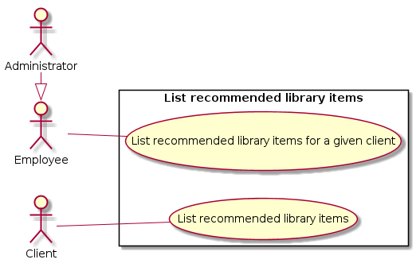
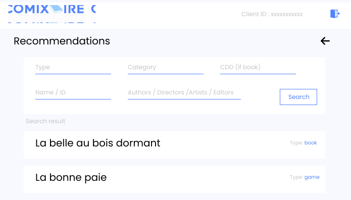
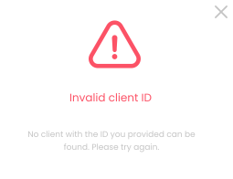

# 1. Display a list of recommended library items

## Use Case Diagram

## 1.1. Brief Description

This use case allows a client to display a list of library items that are recommended for him/her. This use case allows an employee or an administrator to display a list of library items recommended for a client.

## 1.2. Flow of events

### 1.2.1. Basic Flow

This use case starts when an authenticated user wants to consult recommended library items.

* If the authenticated user is a client, the client request recommended library items for itself by clicking on "Recommendations" button.
* If the authenticated user is an employee or an administrator, the actor gives the system a client ID by filling an input box which allows him/she to navigate to client's profil and then click on "Recommendations" button.

After that, the system displays a page with all recommended library items. 

Results can be filtered using a form on the page. None of the form's fields are mandatory, and these fields are :

* Name
* Item type
* Category
* Editor(s) / Author(s) / Director(s) / Artist(s)
* CDD (meaningful only if searching for a book)

### 1.2.2. Alternative Flows

#### 1.2.2.1. Invalid client ID

If the actor is an employee or an administrator and enters an invalid client ID, the system displays an error message. The actor can either return to the beginning of the basic flow or cancel the query, at which point the use case ends.

## 1.3. Special Requirements

None.

## 1.4. Pre-Conditions

Actor must be logged in the system.

## 1.5. Post-Conditions

The system state is unchanged.

## 1.6. Extension Points

None.

