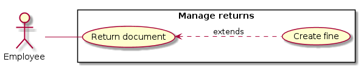

# Use Case Diagram

# 1. Manage Returns

## 1.1 Brief Description

This use case allows employees to cancel loans for clients by returning their documents.

## 1.2 Flow of Events

### 1.2.1 Basic Flow

This use case starts when a client return document(s) at the front desk.

* The employee selects the Returns action on his actions center.
* The employee scans one by one the returned document(s) and show loan information.
* The employee checks book state. If it changed, a fine is created for the borrower.
* The employee validates the returns transaction.
* The system saves the return information and provides a feedback of the transaction completed.

### 1.2.2 Alternative Flows

#### 1.2.2.1 Client Not Found

* The employee selects the Returns action on his actions center.
* The employee scans one by one the returned document(s) and show loan information.
* The system cannot retrieve the borrower, then throw the ClientNotFound exception.
* The employee validates the returns transaction.
* The system saves the return information and provides a feedback of the transaction completed.

#### 1.2.2.2 Document Not Found

* The employee selects the Returns action on his actions center.
* The employee scans one by one the returned document(s).
* The system cannot find the document, then throw the DocumentNotFound exception.
* Return action aborted for this document.

#### 1.2.2.3 Document is Booked

* The employee selects the Returns action on his actions center.
* The employee scans one by one the returned document(s).
* The employee checks book state. If it changed, a fine is created for the borrower.
* System figures out that the document is booked, then prevent the client on available document and employee on not tidy this document.
* The employee validates the returns transaction.
* The system saves the loan information and provides a feedback of the transaction completed.

#### 1.2.2.4 Document Not on Loan

* The employee selects the Returns action on his actions center.
* The employee scans one by one the returned document(s).
* System figures out that the document is not loaned.
* The system abort return action.

## 1.3 Pre-Conditions

The employee must be logged onto the system before this use case begins.

## 1.4 Post-Conditions

If the use case was successful, the returns is saved. The documents are now available. Otherwise, the
system, the client and the documents states are unchanged.