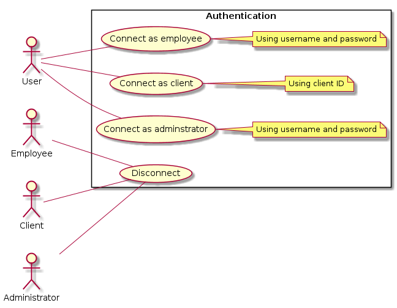

# Use Case Diagram

# 1. Authenticate to media library system

## 1.1. Brief Description

This use case allows any user to handle its authentication to the system. This includes logging in (as an employee or a client) and logging out.

## 1.2. Flow of events

### 1.2.1. Basic Flow

This use case starts when an user of the media library system wants to authenticate (log in) or disconnect (log out).

* If the user wants to authenticate as an employee, the "[Authenticate as an employee](#1211-authenticate-as-an-employee)" subflow is executed.
* If the user wants to authenticate as a client, then “[Authenticate as a client](#1212-authenticate-as-a-client)” sublow is executed.
* If the user wants to authenticate as an administrator, then “[Authenticate as an administrator](#1213-authenticate-as-an-administrator)” subflow is executed.
* If the user wants to disconnect (whatever he’s authenticated as), then “[Disconnect](#1214-disconnect)” subflow is executed.

#### 1.2.1.1. Authenticate as an employee

* The system requests that the user enter its username and its password
* The user enters its username and its password
* The system validates the entered username and password and logs the actor as an employee into the system

#### 1.2.1.2. Authenticate as a client

* The system requests that the user enter its client ID
* The user enters its client ID
* The system validates the client ID and logs the actor as a client into the system

#### 1.2.1.3. Authenticate as an administrator

* The system requests that the user enter its username and its password
* The user enters its username and its password
* The system validates the entered username and password and logs the actor as an administrator into the system

#### 1.2.1.4. Disconnect

The user clicks on a “Logout” button, then the system logs the user out.

### 1.2.2. Alternative Flows

#### 1.2.2.1. Invalid Username/Password

If in the “[Authenticate as an employee](#1211-authenticate-as-an-employee)” (respectively “[Authenticate as an administrator](#1213-authenticate-as-an-administrator)”) subflow, the actor enters an invalid username and/or password, the system displays an error message. The actor can either return to the beginning of the “[Authenticate as an employee](#1211-authenticate-as-an-employee)” (respectively “[Authenticate as an administrator](#1213-authenticate-as-an-administrator)”) subflow or return to the beginning of the “Basic Flow” or cancel the login, at which point the use case ends.

## 1.3. Special Requirements

None.

## 1.4. Pre-Conditions

For subflows “[Authenticate as an employee](#1211-authenticate-as-an-employee)”, “[Authenticate as a client](#1212-authenticate-as-a-client)” and “[Authenticate as an administrator](#1213-authenticate-as-an-administrator)r” : the user must not be logged into the system.

For subflow "[Disconnect](#1214-disconnect)" : the user must be logged into the system.

## 1.5. Post-Conditions

If the use case was successful, the authentication state of the user changed (logged as an employee, a client or an administrator, or disconnected, respectively to subflows). If not, the system state is unchanged.

## 1.6. Extension Points

None.