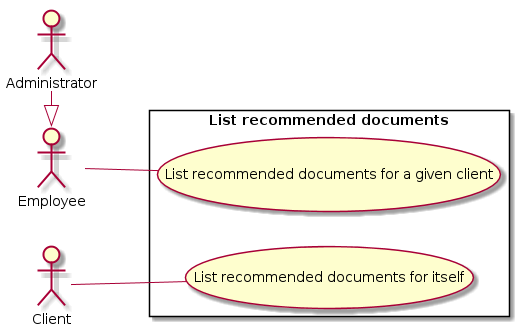

# Use Case Diagram

# 1. Query recommended documents

## 1.1. Brief Description

This use case allows a client to consult documents recommended for him/her. This use case allows an employee or an administrator to consult documents recommended for a client.

## 1.2. Flow of events

### 1.2.1. Basic Flow

This use case starts when an authenticated user wants to consult recommended documents.

* If the authenticated user is a client, the “[Recommendations for self](#1211-recommendations-for-self)” subflow is executed.
* If the authenticated user is an employee or an administrator, the “[Recommendations for a client](#1212-recommendations-for-a-client)” subflow is executed.

#### 1.2.1.1. Recommendations for self

The client asks the system for recommendations and the system displays documents recommended for him/her.

#### 1.2.1.2. Recommendations for a client

* The employee or the administrator ask the system for recommendations for a given client (providing client ID)
* The system validates the provided client ID
* The system displays to the actor, the documents recommended for the client with the given client ID

### 1.2.2. Alternative Flows

#### 1.2.2.1. Invalid client ID

If in the “[Recommendations for a client](#1212-recommendations-for-a-client)” subflow, the actor enters an invalid client ID, the system displays an error message. The actor can either return to the beginning of the “[Recommendations for a client](#1212-recommendations-for-a-client)” subflow or cancel the query, at which point the use case ends.

## 1.3. Special Requirements

None.

## 1.4. Pre-Conditions

Actor must be logged in the system.

## 1.5. Post-Conditions

If the use case was successful, the authentication state of the user changed (logged as an employee, a client or an administrator, or disconnected, respectively to subflows). If not, the system state is unchanged.

## 1.6. Extension Points

None.